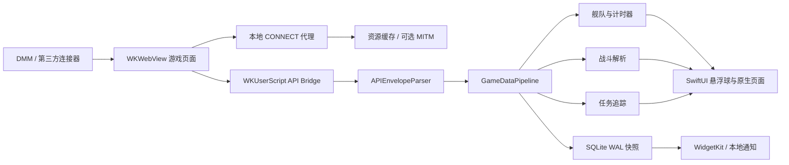

# KanColle Game for iOS

一个面向 iPhone、兼容 iPad 的非官方舰队 Collection 浏览器与辅助信息工具。

本项目主要参考并移植以下 Android 开源项目的设计与功能：

- [antest1/GotoBrowser](https://github.com/antest1/GotoBrowser)：游戏浏览、登录自动化、全屏适配、资源缓存、字幕、截图与 Mod 机制。
- [antest1/kcanotify](https://github.com/antest1/kcanotify)：舰队信息、计时器、大破警告、战斗解析、任务追踪与辅助工具。

> [!IMPORTANT]
> 本项目仍处于开发和真机验证阶段，优先支持 iPhone，其次支持 iPad。目前适合开发者使用 Xcode 自行编译、签名和侧载，不建议作为稳定版本分发。

## 项目目标

在一个 iOS App 中同时提供：

1. 可实际登录和运行舰队 Collection 的游戏浏览器。
2. 不修改游戏请求、不提供自动操作或作弊功能的只读数据辅助。
3. 原生舰队、战斗、任务、计时器、通知和诊断界面。
4. 针对 iPhone `WKWebView` 内存限制的监测和降级方案。

## 当前完成情况

### 游戏浏览器

- [x] DMM、kancolle.moe、OOI 三种连接器。
- [x] 三种连接器共用一套账号密码。
- [x] 账号密码使用系统 Keychain 保存。
- [x] DMM 登录页面自动填充。
- [x] DMM 地区限制 Cookie 处理。
- [x] 登录成功后锁定横屏。
- [x] 隐藏网页导航、页脚等无关区域，仅显示 `1200 × 720` 游戏画面。
- [x] OOI 游戏外壳全屏 DOM 注入与延迟 iframe 布局修复。
- [x] iPhone 全屏等比例缩放和触控坐标适配。
- [x] 静音启动、游戏内静音切换、保持屏幕常亮。
- [x] Canvas 兼容模式与 WebGL 模式切换。
- [x] CreateJS `Ticker.RAF` 帧率解锁，可在设置中关闭。
- [x] 游戏画面截图并保存到系统照片。
- [x] KC3/kcwiki 语音字幕数据、语音匹配和字幕条。

### 悬浮球与原生页面

登录并识别到游戏画面后，只保留游戏画面和悬浮球。点击悬浮球可以打开：

- [x] 舰队页面。
- [x] 战斗页面。
- [x] 任务页面。
- [x] 工具与计时器页面。
- [x] 设置页面。
- [x] 截图、静音、重新加载和退出操作。
- [x] 游戏画面上的舰队/战斗/任务简要 HUD。

这些辅助页面使用 SwiftUI 原生实现，不会创建第二个 `WKWebView`。

### 工具页面

- [x] 海域血条与独立基地航空队面板；会在 `mapinfo` / `base_air_corps` 刷新时更新。
- [x] 明石改修：持有装备筛选、改修日、秘书舰、资源与改修目标。
- [x] 舰娘列表：舰种/受损筛选；等级、入手顺序、维修完成时间、士气排序；基础属性和实际装备详情。
- [x] 装备列表：类型图标与名称、类型筛选、性能、改修与熟练度。
- [x] 舰娘等级经验计算与远征经验参考。
- [x] 远征一览：进行状态、时间、报酬；点击查看旗舰、舰船数、等级、编成、火力、对空、对潜、索敌和士气条件。
- [x] 工具静态资料手动下载、缓存与更新：改修/经验/远征基础资料来自 kcanotify，远征条件来自 poi-plugin-ezexped；远程规则仅按文本解析，不执行下载脚本。

### 游戏 API 采集

- [x] 使用 `WKUserScript` 注入到主页面和游戏 iframe。
- [x] 包装 `XMLHttpRequest`/`fetch`，读取 `/kcsapi/` 响应。
- [x] 默认 HTTPS 盲隧道模式下仍可采集游戏 API。
- [x] `svdata=` 解析、endpoint 规范化和事件去重。
- [x] 在数据进入持久化和诊断前过滤 `api_token`。
- [x] API 数据同时提供给舰队、战斗、任务和字幕模块。

### 舰队、计时器与警告

- [x] `api_start2`、`api_port/port` 和增量端点状态合并。
- [x] 舰队、舰娘、装备、编成、补给、入渠、远征和士气状态。
- [x] Formula 33 索敌计算。
- [x] 制空值范围与士气状态计算。
- [x] 大破 25% 边界判断。
- [x] 普通槽和增设槽损管识别。
- [x] 大破无损管红色警告、有损管橙色警告。
- [x] 入渠、未补给、远征和明石修理状态。
- [x] 远征、入渠、士气和明石四类计时器。
- [x] SQLite WAL 原子快照、冷启动恢复和损坏数据隔离。

### 战斗解析

- [x] 通常舰队、联合舰队和敌联合舰队。
- [x] 航空基地、航空战、支援、开幕雷击和雷击。
- [x] 先制反潜、炮击、友军和夜战。
- [x] 昼战转夜战时继承昼战结束 HP。
- [x] 损管、女神、退避和返航风险。
- [x] 战斗评级预测和服务器结果合并。
- [x] 战斗阶段时间线和舰船 HP 展示。
- [x] 战斗结束后才自动展示 MVP、经验、掉落摘要，避免战斗开始时破坏结果悬念。
- [x] 最多 100 场受限战斗日志。
- [x] API 重复响应不会重复扣血。

### 任务追踪

- [x] 任务列表同步与本地任务定义。
- [x] 基础任务事件路由和精确计数。
- [x] 出击节点、战斗结果、敌舰种和舰队编成条件。
- [x] 日本时间每日、每周、每月和季度重置。
- [x] 未知任务安全降级为 `serverOnly`，不伪造进度。
- [x] iPhone 列表界面与 iPad 自适应分栏。

### 通知与 Widget

- [x] 远征、入渠、士气和明石修理本地通知。
- [x] 四类通知独立开关和提前提醒时间。
- [x] 本地通知 64 条容量规划。
- [x] WidgetKit Small/Medium 计时器小组件。
- [x] App Group SQLite 数据共享。
- [x] App Group 不可用时降级到 Application Support。

### 网络、缓存与可选证书

- [x] Apple Network Framework 本地 HTTP CONNECT 代理。
- [x] 非游戏域名保持普通加密盲隧道。
- [x] 请求阻断规则和域名安全检查。
- [x] 游戏资源磁盘缓存、版本记录和 HTTP 304 重校验。
- [x] 资源大小上限和目录穿越防护。
- [x] Gadget 缓存端点绕行。
- [x] 可选的本地根 CA 生成、导出、安装引导和完全信任检测。
- [x] 可选 MITM 仅面向游戏服务器域名，不解密 DMM 登录域名。
- [x] 设置页显示游戏本地缓存大小并支持后台统计和清理。

默认不要求启用 MITM。舰队、战斗和任务 API 通过页面内 JavaScript 桥采集；只有 HTTPS 资源缓存、资源替换或 `main.js` 内容补丁需要可选的解密模式。

> 资源缓存仅缓存可由本地代理读取的资源响应。HTTPS `CONNECT` 盲隧道下，仍由 WebKit 的系统缓存负责；启用受信任的可选游戏域名 MITM 后，App 自建磁盘缓存才可命中 HTTPS 游戏资源。

### 内存与白屏诊断

- [x] 原生 `phys_footprint` 内存采样。
- [x] 当前 App 内存、会话峰值和最近采样历史。
- [x] 系统内存警告次数和 WebContent 终止次数。
- [x] SSL/网络错误记录和用户提示。
- [x] `webglcontextlost`/`webglcontextrestored` 监听。
- [x] 系统内存警告、App 进入后台和页面进程终止时清理易失缓存。
- [x] Canvas 页面进程终止后提供 WebGL 稳定模式。
- [x] 稳定模式会关闭 FPS 解锁并重新创建 `WKWebView`。
- [x] WebContent 终止后不再静默自动刷新，避免无提示地离开当前游戏页面。

`WKWebContent` 是独立系统进程。iOS 公共 API 无法直接读取它的实际内存，也无法强制回收正在使用的 JavaScript 堆、Canvas 表面或 WebGL 纹理。设置页显示的内存数值仅属于 App 主进程。

## 架构



主要目录：

```text
Game/
├── Browser/       WKWebView、JavaScript Bridge、横屏与恢复
├── Entrance/      连接器、Keychain 和登录自动化
├── Fleet/         舰队信息与警告页面
├── Battle/        战斗覆盖页和日志
├── Quest/         任务追踪页面
├── Tools/         计时器和工具入口
├── Subtitle/      字幕协调与展示
├── Health/        内存、缓存和诊断
└── Settings/      设置、通知和证书引导

Packages/GameCore/
├── 代理、MITM、缓存和脚本补丁
├── P2 舰队/计时器/通知/快照
└── P3 战斗/任务/持久化
```

## 系统要求

- iOS 17.0 或更高版本。
- 优先支持 iPhone 横屏。
- iPad 可运行，部分页面已支持自适应分栏。
- macOS 与可用的 Xcode。
- Apple Developer 签名；Widget/App Group 需要相应 Capability。

## 编译

克隆仓库后打开：

```text
Game.xcodeproj
```

或使用命令行构建：

```bash
DEVELOPER_DIR=/Applications/Xcode.app/Contents/Developer \
xcodebuild -project Game.xcodeproj \
  -scheme Game \
  -destination 'generic/platform=iOS Simulator' \
  build
```

运行 GameCore 测试：

```bash
cd Packages/GameCore
DEVELOPER_DIR=/Applications/Xcode.app/Contents/Developer swift test
```

构建 Widget：

```bash
DEVELOPER_DIR=/Applications/Xcode.app/Contents/Developer \
xcodebuild -project Game.xcodeproj \
  -scheme GameTimersWidget \
  -destination 'generic/platform=iOS Simulator' \
  build
```

## 初次使用

1. 在入口页选择 DMM、kancolle.moe 或 OOI。
2. 输入共用账号密码，并按需保存到 Keychain。
3. 点击开始游戏。
4. 登录成功并识别到游戏画面后，App 会切换横屏并隐藏网页其他部分。
5. 点击悬浮球打开舰队、战斗、任务、工具或设置。

### 可选 HTTPS 资源解密

普通游戏和 API 解析不需要安装证书。

仅当需要 HTTPS 资源缓存、资源替换或 `main.js` 补丁时：

1. 在设置中打开实验性 HTTPS 资源解密。
2. 导出并安装 App 在设备本地生成的根证书。
3. 前往 iOS“设置 → 通用 → 关于本机 → 证书信任设置”启用完全信任。
4. 返回 App 重新检测。

如果 DMM 出现黑屏、SSL 错误或无法进入游戏，请关闭实验性解密并使用默认盲隧道模式。

## 隐私与安全

- 账号密码保存在系统 Keychain，不写入普通偏好设置。
- 三种连接器共用凭证，但凭证不会写入诊断日志。
- API 处理前过滤 `api_token`。
- 战斗日志不保存原始请求、原始响应、昵称或成员 ID。
- 本地根 CA 私钥保存在设备 Keychain。
- MITM 仅允许匹配的游戏服务器域名，DMM 登录等域名保持盲隧道。
- 本项目当前不包含自动点击、宏、脚本操作或作弊功能。

## 已知限制

- 真机 DMM 登录、证书、通知和 Widget 仍需针对不同签名环境继续验证。
- iPhone 的 WebContent 内存限制由系统控制，App 无法读取固定阈值。
- WebContent 被系统终止后，其 JavaScript/Canvas 运行态已经丢失，无法完整恢复当前游戏场景。
- 当前只会保留原生侧已经解析的舰队、战斗、任务和计时状态；是否能恢复网页进度取决于游戏服务器。
- 资源缓存和部分脚本补丁依赖可选 MITM；默认盲隧道下不会修改 HTTPS 响应。
- OOI 的全屏注入已实现，但 OOI、kancolle.moe 的登录与 iframe 结构仍需要更多真机兼容性验证。
- iPad 尚未完成“游戏画面 + 工具面板”常驻并排布局。
- 工具资料需用户在工具页手动下载；若上游数据格式变化，会安全显示“资料未标注”而不猜测条件。
- 静态资料解析目前只显示远征条件，尚未在发送远征前自动判定所选舰队是否满足每一项条件。

## 后续计划

- 远征编成自动验算、大发/闪卡大成功率和收益估算。
- 掉落、建造、开发与资源日志。
- 原生图表、备份与恢复。
- 妖精皮肤、KCCP 翻译补丁和 Kantai3D。
- iPad 游戏与工具常驻分屏。
- 多语言 String Catalog。
- 静态数据完整离线包、签名/版本校验和应用资源更新器。

详细任务见 [`docs/superpowers/remaining-tasks.md`](docs/superpowers/remaining-tasks.md)。

## 上游项目与致谢

本项目不是 `antest1` 的官方 iOS 版本，但大量功能设计、数据结构、算法和实现思路来自：

- [GotoBrowser](https://github.com/antest1/GotoBrowser)  
  Copyright © 2019–2025 antest1 (IE10)
- [kcanotify](https://github.com/antest1/kcanotify)  
  Copyright © 2016–2026 antest1 (IE10)

两个上游项目均采用 GNU General Public License v3.0。公开发布本项目或其二进制版本时，应保留上游版权与来源说明，并遵守相应开源许可证。

字幕、翻译和游戏资源的权利归各自作者或权利人所有。

## 免责声明

本项目是非官方、非商业的学习与移植项目，与 DMM、C2、角川或舰队 Collection 官方无关。

使用者应自行确认所在地区法律、DMM 服务条款、游戏运营规则以及证书安装带来的安全影响。项目作者不对账号、数据、网络、设备或游戏进度损失承担责任。
